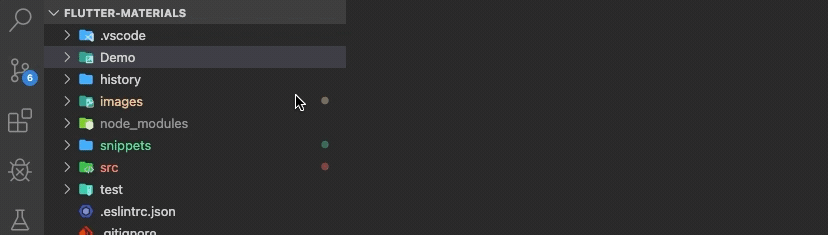
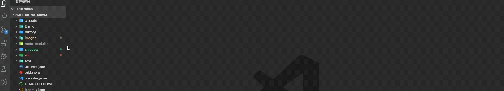

# Flutter-Materials

Flutter物料 vscode插件，可以一键生成物料

## Materials

### Use

在需要生成物料的文件夹上，鼠标右键点击，选择Materials Install。

;

在VsCode上方会弹出选择物料框，此时选择相应物料即可在文件夹下生成物料。

### Documents

| 物料分类 | 物料版本 | 描述 |
| --- | --- | --- |
| flutter | ui_controller_net_entity | 生成完成页面物料 |
| flutter | widget-full.dart | 生成fulState页面 |
| flutter | widget-less.dart | 生成lessState页面 |
| react | antd-redux-3.12.1 | 生成react增删查改物料 |

## Snippets

### Use

使用`Flutter-Materials-Snippets`直接在`dart`文件中写入命令即可有提示生成。

### Documents

| 代码片段命令 | 描述 |
| --- | --- |
| fl_ful_widget | 完整fulWidget片段 |
| fl_less_widget | 完整lessWidget片段 |
| fl_text | Text组件片段 |
| fl_tabbar | TabBar组件片段 |
| fl_row | Row组件片段 |
| fl_gesture | GestureDetector组件片段 |
| fl_stack | Stack定位组件片段 |
| fl_container | Container组件片段 |
| fl_expanded | Expanded组件片段 |

## Optimized

- 物料名称统一替换
- 物料路径统一梳理
- 支持下划线名称，在物料指定位置会转化为驼峰

## Connect Me

> Email: cuishijie@inke.cn